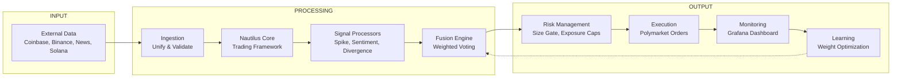

# 🤖 Polymarket BTC 15-Minute Trading Bot

[](https://www.python.org/downloads/)
[](https://nautilustrader.io/)
[](https://opensource.org/licenses/MIT)
[](https://polymarket.com)
[](https://redis.io/)
[](https://grafana.com/)

A production-grade algorithmic trading bot for **Polymarket's 15-minute BTC price prediction markets**. Built with a 7-phase architecture combining multiple signal sources, professional risk management, and self-learning capabilities.


---

## 📋 **Table of Contents**
- [Features](#features)
- [Architecture](#architecture)
- [Prerequisites](#prerequisites)
- [Quick Start](#quick-start)
- [Configuration](#configuration)
- [Running the Bot](#running-the-bot)
- [Monitoring](#monitoring)
- [Trading Modes](#trading-modes)
- [Project Structure](#project-structure)
- [Testing](#testing)
- [Contributing](#contributing)
- [FAQ](#faq)
- [License](#license)
- [Disclaimer](#disclaimer)

---

## ✨ **Features**

| Feature | Description |
|---------|-------------|
| **7-Phase Architecture** | Modular, testable, production-ready design |
| **Multi-Signal Intelligence** | Spike Detection, Sentiment Analysis, Price Divergence |
| **Risk-First Design** | Strict live size gate, explicit `limit_ioc` order config, exposure caps, and settlement reconciliation pause |
| **Explicit Mode Operation** | Simulation observes decisions; live startup requires Redis control |
| **Real-Time Monitoring** | Grafana dashboards + Prometheus metrics |
| **Self-Learning** | Automatically optimizes signal weights based on performance |
| **Auto-Recovery** | WebSocket auto-reconnection, rate limiting, data validation |
| **Decision-Only Simulation** | Records candidate decisions only; no live-equivalent fills or P&L |

---

## 🏗️ **Architecture**

### **7-Phase Overview**


## Prerequisites
- Python 3.14+ (Download)

- Redis (Download) - for mode switching

- Polymarket Account with API credentials
- Git

## 🚀 Quick Start

## 1. Clone the Repository

```bash
git clone https://github.com/yourusername/polymarket-btc-15m-bot.git
cd polymarket-btc-15m-bot
```
## 2. Set Up Virtual Environment

```bash
# Windows
python -m venv venv
venv\Scripts\activate

# macOS / Linux
python3 -m venv venv
source venv/bin/activate
```
## 3. Install Dependencies

```
bash
pip install -r requirements.txt
```
## 4. Configure Environment Variables

Repo-root plaintext `.env` is for local simulation/test-mode runs only. Live
deployments must use SOPS through `/opt/polybot/secrets/.env.sops.yaml`; follow
[deploy/README.md](deploy/README.md) for live first-run setup.

For local simulation, create or edit `.env` with non-production credentials:

```env
# Polymarket API Credentials (local simulation/test-mode only)
POLYMARKET_PK=your_private_key_here
POLYMARKET_FUNDER=your_deposit_or_wallet_address_here
POLYMARKET_SIGNATURE_TYPE=3
POLYMARKET_API_KEY=wallet_derived_api_key_here
POLYMARKET_API_SECRET=wallet_derived_api_secret_here
POLYMARKET_PASSPHRASE=wallet_derived_passphrase_here

# Redis Configuration
REDIS_HOST=localhost
REDIS_PORT=6379
REDIS_DB=2
NAUTILUS_LOG_DIR=./logs/nautilus

# Trading Parameters (SMOKE-TEST CONFIG shown — change to production after smoke trade settles)
# MARKET_BUY_USD must be STRICTLY > 5.50 for live mode (smoke-test minimum: 5.51).
# Production sizing per the plan: MARKET_BUY_USD=55.00, MAX_POSITION_SIZE=55.00,
# MAX_TOTAL_EXPOSURE=385.00, MAX_POSITIONS=7, MAX_LOSS_PER_DAY=110.00.
# Sizing invariants: MAX_POSITION_SIZE >= MARKET_BUY_USD;
# MAX_TOTAL_EXPOSURE >= MAX_POSITION_SIZE * MAX_POSITIONS.
MARKET_BUY_USD=5.51
MAX_POSITION_SIZE=5.51
MAX_TOTAL_EXPOSURE=22.04
MAX_POSITIONS=4
MAX_DRAWDOWN_PCT=0.15
MAX_LOSS_PER_DAY=11.02
REQUIRE_SIGNAL_CONFIRMATION=true
MIN_SIGNAL_CONFIDENCE=0.70
EV_FEE_BUFFER=0.005
EV_SPREAD_BUFFER=0.01
LIVE_SETTLEMENT_GRACE_SECONDS=3600
REQUIRE_AUTO_REDEEM_TOKEN_HINT=true
LIVE_TRADE_LEDGER_PATH=live_trades.json
POLYGON_RPC_URL=https://your-polygon-rpc.example

# Live sizing. fixed uses MARKET_BUY_USD. percent uses
# PCT_OF_FREE_COLLATERAL_PER_TRADE and rejects, rather than clamps, if the
# computed size exceeds MAX_POSITION_SIZE.
SIZING_MODE=fixed
#PCT_OF_FREE_COLLATERAL_PER_TRADE=0.05
MAX_ACCOUNT_STATE_AGE_SECONDS=30
BALANCE_SAFETY_BUFFER_USD=0.00

# Live order type. Routine live resume should use limit_ioc.
ORDER_TYPE=limit_ioc
QUOTE_STABILITY_REQUIRED=3
LIMIT_REQUIRED_EDGE=0.05
LIMIT_IOC_FILL_POLICY=partial_ok
```

Boolean flags accept only explicit values: `true`, `false`, `1`, `0`, `yes`,
`no`, `on`, or `off`. Invalid values abort instead of being silently coerced.

### Env vars that are NOT wired

The following were previously listed but are not read by the bot. Setting them in
`.env` has zero effect on runtime behavior:

- `STOP_LOSS_PCT`, `TAKE_PROFIT_PCT` — the bot has no per-position exit loop and
  Polymarket does not support stop orders. Strike from `.env`.
- `SPIKE_THRESHOLD`, `DIVERGENCE_THRESHOLD` — these are **code-owned constants**
  in `bot.py` (both `0.05`). Setting them in `.env` does not change behavior.
  To adjust, edit `bot.py` and restart.

### Live startup gates

`--live` enforces three startup gates before any Nautilus node is built:

1. **Explicit sizing and fresh free collateral.** `SIZING_MODE` is required in
   live mode. `fixed` uses `MARKET_BUY_USD` and keeps the strict
   `MARKET_BUY_USD > 5.50` startup/runtime gate. `percent` requires
   `PCT_OF_FREE_COLLATERAL_PER_TRADE` in `(0, 1)` and computes the per-trade
   budget from the latest Polymarket `AccountState` pUSD free collateral.

   Both modes require `MAX_ACCOUNT_STATE_AGE_SECONDS`,
   `MAX_DECISION_SNAPSHOT_AGE_SECONDS`, and `BALANCE_SAFETY_BUFFER_USD`. A live
   decision is rejected if no AccountState has arrived, if the frozen decision
   snapshot ages past `MAX_DECISION_SNAPSHOT_AGE_SECONDS` before execution, if
   free collateral is below `resolved_trade_usd + BALANCE_SAFETY_BUFFER_USD`,
   or if the resolved size exceeds `MAX_POSITION_SIZE`. Percent sizing rejects
   oversized trades rather than silently clamping them.

2. **Explicit order configuration.** Order-capable runs require `ORDER_TYPE`
   and `QUOTE_STABILITY_REQUIRED`; live mode validates them before building the
   Nautilus node and the strategy validates them again at every decision.
   Routine live resume should use
   `ORDER_TYPE=limit_ioc`, `QUOTE_STABILITY_REQUIRED=3`,
   `LIMIT_REQUIRED_EDGE=0.05`, and `LIMIT_IOC_FILL_POLICY=partial_ok`.
   The bot enforces `LIMIT_REQUIRED_EDGE >= EV_FEE_BUFFER + EV_SPREAD_BUFFER`
   so the limit cap and EV gate are configured consistently.
   `market_ioc` remains available only when the operator explicitly accepts
   book-sweep price risk. The current `limit_ioc` path uses Nautilus
   `TimeInForce.IOC`, which maps to Polymarket FAK, so `all_or_nothing` is
   blocked until a verified FOK submission path exists.

3. **Explicit live confirmation.** `--live` alone prompts the operator to type
   exactly the literal `LIVE` (case sensitive, no whitespace tolerance). Pass
   `--live --confirm-live` to skip the prompt for unattended startup (systemd,
   cron, Docker without `-it`, etc.). `--confirm-live` without `--live` is
   rejected at argument parsing. On non-interactive stdin (no TTY), the prompt
   treats `EOFError` as "operator did not confirm" and aborts cleanly with a
   `SystemExit` instead of a Python traceback.

`live_trades.json` stores filled live trades until Polymarket sends `auto_redeem`.
If no payout event arrives after `LIVE_SETTLEMENT_GRACE_SECONDS`, the bot marks
the trade as `SETTLEMENT_UNKNOWN` instead of fabricating a $0 loss. A delayed
`auto_redeem` can still correct the record and update realized P&L. Live submit
requires valid market settlement metadata; missing `market_end_time` is rejected
instead of using a secondary timeout. Live trading pauses while any
unresolved ledger state exists: unresolved `SETTLEMENT_UNKNOWN` records
(`needs_reconciliation=true` or `settlement_source="SETTLEMENT_UNKNOWN"`),
pending actual fills, unresolved submitted order intents, or a ledger-blocked
marker.

Manual reconciliation is explicit and auditable. Stop the bot first, verify the
actual settlement externally, resolve exactly one unknown order, then restart the
bot so it reloads the ledger:

```bash
venv/bin/python mark_settlement_resolved.py \
  --ledger /path/to/live_trades.json \
  --order-id ORDER_ID \
  --payout 0 \
  --reason "Verified no redeemable payout in Polymarket UI on 2026-05-18"
```

The tool takes the same `live_trades.json.lock` used by the bot and refuses to
run while the bot is running. It requires an explicit `--ledger` path and prints
the exact resolved ledger and lock paths before writing. It changes
`settlement_source` to `manual_reconciliation`,
records the previous unknown state, computes P&L from the verified payout, and
clears `needs_reconciliation`. It does not add an automatic override or hidden
resume path.

If `live_trades.json` is corrupt or unreadable, startup fails closed. Repair the
JSON manually from a known-good copy before starting live mode. Keep external
snapshots of this file, for example with a cron job that copies it to a dated
backup path outside the repo.

If the live ledger blocks during a fill callback, later fill callbacks fail
closed until the process is repaired and restarted. Some blocked direct-fill
paths may create a durable external-repair `SETTLEMENT_UNKNOWN` without usable
accounting fields; they must not be resolved until the operator supplies
verified external fill values. During recovery, verify the order state from
Polymarket exchange/order records; do not rely only on `live_trades.json`. If a
filled order is missing from the ledger entirely, create a `SETTLEMENT_UNKNOWN`
record from the external order details, then resolve it with the verified payout:

```bash
venv/bin/python mark_settlement_resolved.py \
  --ledger /path/to/live_trades.json \
  --create-unknown-from-external-order ORDER_ID \
  --confirm-external-order \
  --external-size 2.00 \
  --external-entry-price 0.50 \
  --external-filled-qty 4 \
  --external-direction long \
  --external-trade-label "YES (UP)" \
  --external-instrument-id "cond-token.POLYMARKET" \
  --external-token-id TOKEN_ID \
  --external-slug MARKET_SLUG \
  --external-condition-id CONDITION_ID \
  --external-submitted-at 2026-05-18T12:00:00Z \
  --external-filled-at 2026-05-18T12:00:02Z \
  --external-market-end-time 2026-05-18T12:15:00Z \
  --reason "Rebuilt from Polymarket order records after ledger write failure"
```

The reconstruction command rejects inconsistent fill math unless
`--external-size` matches `--external-entry-price * --external-filled-qty`
within exact `1E-18` accounting tolerance, rejects entry prices outside
`0 < price <= 1`, and rejects impossible ordering unless
`submitted_at <= filled_at <= market_end_time`. After creating the unknown
record, resolve it with the verified payout using `--order-id ORDER_ID --payout
PAYOUT --reason "..."` plus the same explicit `--ledger /path/to/live_trades.json`.

`REQUIRE_AUTO_REDEEM_TOKEN_HINT=true` avoids assigning wallet-level redeem
payouts to bot trades when the event does not identify the token or outcome.
Those events are kept in the ledger as pending retry/reconciliation items, with
no age-based pruning or 500-event cap. Before relying on live settlement,
capture and inspect at least one real Polymarket `auto_redeem` log line and
confirm the payload includes one of the supported token/outcome fields:
`asset_id`, `assetId`, `token_id`, `tokenId`, `clobTokenId`, `clob_token_id`,
`outcome`, `redeemed_outcome`, `redeemedOutcome`, `winning_outcome`, or
`winningOutcome`. A `side` field is accepted only when its value is a normalized
outcome (`yes`, `up`, `no`, or `down`); execution-side values such as `BUY` do
not unlock settlement matching.

Also verify that the real `auto_redeem` payload includes a parseable `timestamp`
in seconds or milliseconds. Missing or invalid timestamps are left pending for
manual review; the bot does not fabricate settlement time.

`EV_FEE_BUFFER` and `EV_SPREAD_BUFFER` are heuristic confidence buffers. The
current fused signal confidence is not a calibrated settlement probability, so
these values filter low-confidence entries but are not a true mathematical EV
model.

Simulation records decision observations only. These records do not go through
live-equivalent order submission, fill tracking, settlement ledger writes,
`auto_redeem`, position/P&L accounting, or live failure behavior. They remain
`PENDING` and must not be used as a win-rate or P&L source until a separate
live-equivalent paper execution engine is implemented.

### Decision/paper observation result estimates

`decisions.jsonl` does not store the final market outcome at decision time,
because the BTC 15-minute market is normally still open when the decision is
recorded. It stores the join keys and decision-side estimate instead:

- `slug`
- `condition_id`
- `yes_token_id` / `no_token_id`
- `decided_direction`
- `executable_entry`
- `estimated_tokens_filled`
- `estimated_actual_cost`
- `depth_fully_filled`

`estimate_decision_results.py` resolves the final outcome later by fetching the
closed Polymarket Gamma market for each logged `slug`. It maps `Yes`/`Up` to
`long`, maps `No`/`Down` to `short`, keeps still-open markets as `PENDING`, and
fails closed if a closed market does not have exactly one winning outcome.

For quick observation, use simulation/test mode, not `--live`. Example `.env`
settings:

```env
NAUTILUS_LOG_DIR=./logs/nautilus
ORDER_TYPE=limit_ioc
QUOTE_STABILITY_REQUIRED=1
LIMIT_REQUIRED_EDGE=0.05
LIMIT_IOC_FILL_POLICY=partial_ok
EV_FEE_BUFFER=0.005
EV_SPREAD_BUFFER=0.01
```

Run:

```bash
venv/bin/python bot.py --test-mode
```

Observe raw decision records:

```bash
tail -f decisions.jsonl
tail -f paper_trades.json
venv/bin/python view_paper_trades.py
```

After one or more observed markets have closed, estimate resolved win/loss:

```bash
venv/bin/python estimate_decision_results.py decisions.jsonl --stake-usd 5.51
```

This report is an estimate only. It uses the logged decision-side estimated fill
size/cost and the later Gamma outcome. It excludes real order submission
failures, live fill drift, fees, settlement timing, ledger repair paths, and
realized live P&L accounting. Older decided records that do not include
`estimated_tokens_filled` and `estimated_actual_cost` are not suitable for this
estimator.

For the calibration gate, use the Path A + Path B analyzer instead:

```bash
venv/bin/python analyze_calibration.py --ledger live_trades.json --decisions decisions.jsonl
```

Path B joins every decision with a fused signal, including rejected decisions,
to the closed Polymarket Gamma market resolution and reports bucketed
calibration, Brier score, and log-loss. Entry/edge metrics, including Wilson
edge after buffers, are computed only on records that also have executable-entry
and estimated-cost fields. This is the calibration gate; the estimator above is
only a quick inspection tool.

For Polymarket's current deposit-wallet flow, `POLYMARKET_PK` is the private key for the signer wallet and `POLYMARKET_FUNDER` is the Polymarket deposit wallet address. Do not guess the funder address from MetaMask; discover it from Polymarket:

```bash
venv/bin/python configure_polymarket_deposit_wallet.py
```

Then derive and record the wallet-derived CLOB API credentials:

```bash
venv/bin/python derive_polymarket_api_creds.py
```

Do not use Builder or Relayer API keys for `POLYMARKET_API_KEY`; the bot expects wallet-derived CLOB API credentials.

Check the CLOB balance seen by the bot. This is the number the live trading adapter will use:

```bash
venv/bin/python check_polymarket_balance.py --sync
```

For older direct MetaMask/EOA trading only, set `POLYMARKET_FUNDER` to the same public address shown in MetaMask and `POLYMARKET_SIGNATURE_TYPE=0`. If that wallet has Polygon USDC.e but CLOB allowances are `0`, approve the spender contracts from the MetaMask EOA wallet:

```bash
POLYGON_RPC_URL=https://your-polygon-rpc.example venv/bin/python approve_polymarket_clob.py
POLYGON_RPC_URL=https://your-polygon-rpc.example venv/bin/python approve_polymarket_clob.py --execute
venv/bin/python check_polymarket_balance.py --sync
```
## 5. Start Redis
```
bash
# Windows (download from redis.io)
redis-server

# macOS
brew install redis
redis-server

# Linux
sudo apt install redis-server
redis-server
```
## 6. Run the Bot
```
bash
# Test mode (decision observations every minute - for quick signal checks)
python bot.py --test-mode

# Live trading mode (REAL MONEY!)
# Use deploy/README.md and SOPS; repo-root plaintext .env is refused in live.
python bot.py --live --confirm-live
```
## ⚙️ Configuration Options
Argument	Description	Default
--test-mode	Decision observations every minute	False
--live	Enable live trading (real money)	False
--no-grafana	Disable Grafana metrics	False
## View Decision Observations
```
bash
python view_paper_trades.py
```
## Trading Modes
Redis controls the active mode only inside a live-enabled `--live` process.
A process launched without `--live` is simulation-only and cannot become live
through Redis; restart with `--live` for real order submission.

# Pause a live-enabled process into simulation mode (safe)
```
python redis_control.py sim -- not stable yet
```
# Resume live trading inside a live-enabled process (REAL MONEY!)
```
python redis_control.py live --not stable yet
``` 
## 📁 Project Structure

```text
polymarket-btc-15m-bot/
├── core/                        # Core business logic
│   ├── ingestion/               # Phase 2: Data ingestion
│   │   ├── adapters/            # Unified adapter interface
│   │   ├── managers/            # Rate limiter, WebSocket manager, etc.
│   │   └── validators/          # Data validation & schema checks
│   ├── nautilus_core/           # Phase 3: NautilusTrader integration
│   │   ├── data_engine/         # Nautilus data engine wrapper
│   │   ├── event_dispatcher/    # Event handling & dispatching
│   │   ├── instruments/         # BTC/USDT instrument definitions
│   │   └── providers/           # Custom live/historical data providers
│   └── strategy_brain/          # Phase 4: Signal generation & processing
│       ├── fusion_engine/       # Multi-signal combination logic
│       ├── signal_processors/   # Individual detectors (spike, divergence, sentiment…)
│       └── strategies/          # Main 15-minute BTC trading strategy
│
├── data_sources/                # Phase 1: External market & sentiment data
│   ├── binance/                 # Binance WebSocket client
│   ├── coinbase/                # Coinbase REST API client
│   ├── news_social/             # Fear & Greed Index + social sentiment
│   └── solana/                  # Solana RPC (optional / experimental)
│
├── execution/                   # Phase 5: Order placement & risk control
│   ├── execution_engine.py      # Main order execution coordinator
│   ├── polymarket_client.py     # Polymarket API wrapper & order logic
│   └── risk_engine.py           # Position sizing and exposure limits
│
├── monitoring/                  # Phase 6: Performance tracking & metrics
│   ├── grafana_exporter.py      # Prometheus metrics exporter
│   └── performance_tracker.py   # Trade logging & statistics
│
├── feedback/                    # Phase 7: Future learning / optimization
│   └── learning_engine.py       # Placeholder for ML feedback loop
│
├── grafana/                     # Grafana dashboard & configuration
│   ├── dashboard.json           # Pre-built dashboard definition
│   ├── grafana.ini              # Grafana server config (optional)
│   └── import_dashboard.py      # Script to import dashboard automatically
│
├── scripts/                     # Development & testing utilities
│   ├── test_data_sources.py
│   ├── test_ingestion.py
│   ├── test_nautilus.py
│   ├── test_strategy.py
│   └── test_execution.py
│
├── .env.example                 # Template for environment variables
├── .gitignore
├── patch_gamma_markets.py       # Temporary patch/fix for Polymarket API
├── redis_control.py             # Runtime mode control for live-enabled runs
├── requirements.txt             # Python dependencies
├── bot.py                       # Main bot entry point
├── 15m_bot_runner.py            # Auto-restart wrapper for bot.py
├── view_paper_trades.py         # View simulation decision observations
└── README.md                    # This file
```
Testing
Run tests for each phase independently:

# Test individual phases
```
python scripts/test_data_sources.py
python scripts/test_ingestion.py
python scripts/test_nautilus.py
python scripts/test_strategy.py
python scripts/test_execution.py
```
🤝 Contributing
Contributions are welcome! Here's how you can help:

 - Fork the repository

 - Create a feature branch: git checkout -b feature

 -Commit your changes: git commit -m 'Added feature'

- Push to the branch: git push origin feature/added-feature

Open a Pull Request

## Ideas for Contributions
- Add derivatives data (funding rates, open interest)

- Implement more signal processors

- Add Telegram/Discord alerts

- Create web UI for management


- Support for ETH/SOL markets

- Machine learning optimization

## ❓ FAQ

**Q: How much money do I need to start?**  
**A:** Fixed live sizing requires `MARKET_BUY_USD > 5.50`; percent sizing
uses `PCT_OF_FREE_COLLATERAL_PER_TRADE` and fresh AccountState free collateral.
Use `$5.51` only for the first smoke test; normal live sizing should follow
the plan/config, currently the `$55` per-trade target for fixed mode.

**Q: Is this profitable?**  
**A:** No claim is made from simulation records. Current simulation is
decision-only observation, not live-equivalent execution or settlement.

**Q: Do I need programming experience?**  
**A:** Basic Python knowledge is helpful (e.g. understanding how to run scripts and edit config files), but the bot is designed to run with just a few simple commands — no coding required for normal use.

**Q: Can I run this 24/7?**  
**A:** Yes! The bot is built for continuous operation and includes basic auto-recovery features in case of temporary connection issues.

**Q: What's the difference between test mode and normal mode?**  
**A:**  
- **Test mode** — decision observations every minute (great for quick signal/debug checks)
- **Normal mode** — trades every 15 minutes (matches the intended 15-minute strategy timeframe)

 
## Disclaimer
TRADING CRYPTOCURRENCIES CARRIES SIGNIFICANT RISK.

This bot is for educational purposes

Past performance does not guarantee future results

Always understand the risks before trading with real money

The developers are not responsible for any financial losses

Use simulation only to observe decisions; use small live size only after checking live settlement behavior.

## Acknowledgments
NautilusTrader - Professional trading framework

Polymarket - Prediction market platform


All contributors and users of this project

## Contact & Community
GitHub Issues: For bugs and feature requests

Twitter: @Kator07

##Discord: Join our community
- https://discord.gg/tafKjBnPEQ

## ⭐ Show Your Support
If you find this project useful, please star the GitHub repo! It helps others discover it.

## contact me on telegram 
 [](https://t.me/Bigg_O7)
